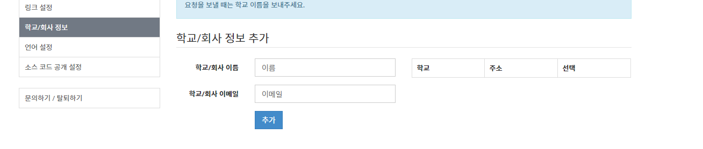

# Yedang-Algorithm-Study
예당고등학교 알고리즘 스터디

## 1. 동아리 운영 방식
매달 백준 ***예당 스터디*** 그룹의 연습탭에서 한달치 문제를 시간내에 풀면 됨

## 2. 백준 가입 방법

[백준 사이트](https://www.acmicpc.net/)에 들어가서 백준에 가입함

그 다음 학교추가로 예당고등학교를 추가



그 다음 solved.ac확장을 사용 누르셈


다 했으면 카톡방에 아이디를 올려주세요, 제출 마감일 임박해서 가입신청하면 신청 못 받아줄 수 있으니 유의

## 3. 가입하고 나서 문제 푸는 법

그룹 탭에 들어가면 연습이란게 있을거임


누르면 문제 리스트가 뜹니다.


원하는 문제를 골라서 누르면 문제 푸는곳으로 이동합니다

학교에서 배운 python으로 푸는걸 권장하는데 다른 언어여도 상관이 없습니다.


문제 잘 읽고 제출탭 가셔서 언어 선택하시고 정답코드 제출하세요.
입력이 들어오면 출력으로 나오게 만들면됩니다.

예시로
1000번 같은 경우는 파이썬으로는 
```python
a, b = input().split()
print(int(a) + int(b))
```

이렇게 풀립니다.
입력이 `3 1` 이런식으로 공백을 사이로 두고 주어지니 `input()`으로 한줄을 받고 `.split()`으로 공백을 기준으로 두개로 나누고 `a`, `b`에 각각 담습니다.

그 다음 int로 각각 변환(`int()`를 씌움) 하고 더해서 `+` 출력해주면 됩니다. (`print()`)

응용해서 1001도 풀 수 있습니다.

정 모르겠음 학교에서 저 찾아오던지 카톡방에서 물어봐주세요

첫 달은 쉬운거로 채워뒀습니다.

## 4. 팁

제출탭에서 코드 짜지말고 다른곳에서 돌려보고 작동하면 제출하세요.
저를 많이 써먹으세요. 아희로 풀어드림


